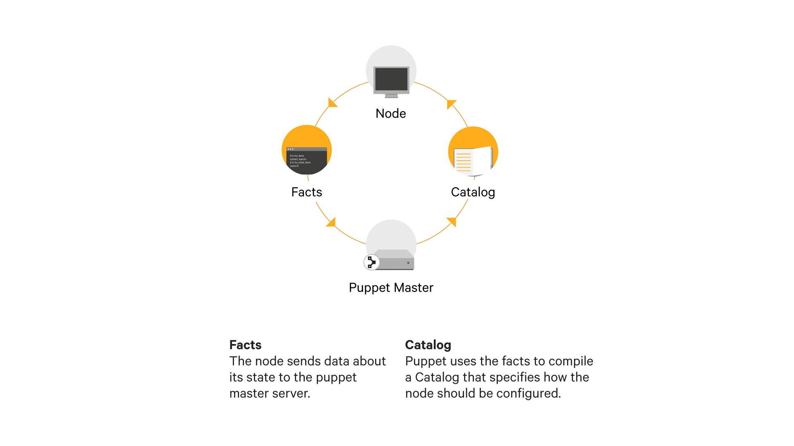



# Agent run

## Quest objectives

- Understand the process of a Puppet agent run.
- Learn how to list and sign agent certificates.
- Use the *site.pp* manifest to classify a node.

## Get started

> Now, here you see, it takes all the running you can do, to keep in the same place.

> - Lewis Carroll

The `puppet resource` command you explored in the previous quest let you see a
system the way Puppet does—through the resource abstraction layer. While
exploring and manipulating resources through Puppet's command line tools are
useful, the real value of the resource abstraction layer is to provide a single
common language for your Puppet master to manage all the systems in your
infrastructure.

In this quest, we'll walk through a Puppet agent run to demonstrate how the
Puppet agent communicates with the Puppet master server. We'll then write some
Puppet code to a manifest on the Puppet master to begin defining a desired
state for our agent system.

Ready to get started? Run the following command on your Learning VM:

    quest begin agent_run

## The agent/master architecture

As we mentioned in the previous quest, Puppet is typically used in what's
called an agent/master (client/server) architecture.

In this architecture, each managed node in your infrastructure runs a *Puppet
agent* service. One or more servers (depending on the size and complexity of
your infrastructure) act as *Puppet master(s)* and run the Puppet server
service to handle communication with your agents. In a default *monolithic*
master installation, the Puppet master server also hosts several supporting
services such as the PE console services and PuppetDB. In larger deployments
these services may be distributed across other servers to improve performance
and provide redundancy.

By default, the Puppet agent service initiates a Puppet run every half-hour.
This periodic run ensures that your system stays in the desired state you
described in your Puppet code. Any configuration drift that occurs between runs
is remediated the next time the agent runs.

We've disabled these automatic runs on the Learning VM's agent systems.
Instead, you'll manually trigger runs to get more control and visibility as you
learn how Puppet works.



The Puppet agent begins a Puppet run by sending a *catalog request* to the
Puppet master. This request includes some information about the agent system
provided by a tool called *Facter*.

The Puppet master uses this information from Facter along with your Puppet code
to compile a catalog that tells the agent exactly how the resources on its
system should be configured.

Your Puppet master keeps a copy of the Puppet codebase you've created to define
the desired state for systems in your infrastructure. This Puppet code is
primarily made up of resource declarations like the ones you saw in the
previous quest. While your Puppet code's final purpose is to define resources,
it also includes some language features such as variables, classes, and
conditionals that can give you control over which resources you want on a
system and how their parameters are set. The master parses this code to create
a *catalog*. The catalog is the final list of system resources that
define the desired state for an agent node.

The Puppet master sends this catalog back to the Puppet agent, which then uses
its *providers* to check if the desired state of each resource defined in the
catalog matches the actual state of the resource on the system. If any
differences are found, the providers help Puppet implement whatever changes are
necessary to bring the actual state of the system into line with the desired
state defined in the catalog.

Finally, the Puppet agent generates a report that includes information about
unchanged resources, successful changes, and any errors it may have encountered
during the run. It sends this report back to the Puppet master, which stores
it in PuppetDB and makes it available via the PE console's web GUI.

## Certificates

There's one more thing to note before we can move on to demonstrating a Puppet
agent run.

All communications between an agent and master happen over SSL. Before the
master communicates with an agent, it needs a way to validate that the agent
node is authentic. This prevents unauthorized connections from spoofing
an agent node to access sensitive data that might be included in a
catalog. While Puppet does provide [options for encrypting
data](https://puppet.com/blog/encrypt-your-data-using-hiera-eyaml) within a
catalog, it's best to control which systems can make a catalog request in the
first place.

Puppet requires any system contacting the Puppet master to
authenticate with a signed certificate. The first time a Puppet agent contacts
the Puppet master, it will submit a *certificate signing request (CSR)*. A
Puppet administrator can then validate that the system sending the CSR should
be allowed to request catalogs from the master before deciding to sign the
certificate. (You can read more about the details of Puppet's cryptographic
security and the certification system on the [docs
page](https://docs.puppet.com/background/ssl/index.html))

<div class = "lvm-task-number"><p>Task 1:</p></div>

Start by connecting to your agent system. When you
began this quest, the system you used in the last quest was destroyed and a new
one was created. This new system has the Puppet agent pre-installed, so there's
no need to repeat the installation process. Go ahead and connect to the new
agent system with the same credentials you used in the last quest:

**username: learning**  
**password: puppet**

    ssh learning@agent.puppet.vm

First, try to trigger a Puppet agent run without your agent system's certificate
signed. The agent will attempt to contact the Puppet master, but its request
will be rejected.

    sudo puppet agent -t

You'll see a notification like the following:

    Exiting; no certificate found and waitforcert is disabled

No problem: you just have to sign the certificate. For now, we'll show you how
to do it from the command line. If you prefer a GUI, the PE console includes
[tools for certificate
management](https://docs.puppet.com/pe/latest/console_cert_mgmt.html).

<div class = "lvm-task-number"><p>Task 2:</p></div>

First, exit your SSH session to return to the your Puppet master:

    exit

Use the `puppet cert` tool to list unsigned certificates:

    puppet cert list

Sign the cert for `agent.puppet.vm`:

    puppet cert sign agent.puppet.vm

<div class = "lvm-task-number"><p>Task 3:</p></div>

With that taken care of, your Puppet agent is authorized to make catalog
requests.

## Triggering a Puppet run

As noted above, the default for the Puppet agent service is to initiate a
Puppet run every thirty minutes. Because it would be hard to clearly demonstrate Puppet
with these scheduled background runs, we've disabled the Puppet agent
service on your agent system. Instead, you can use the `puppet agent -t`
command to manually trigger a run.

Go ahead and connect to your agent node:

    ssh learning@agent.puppet.vm

Trigger an agent run. Now that the agent's certificate is signed, it will
receive a catalog from the Puppet master.

    sudo puppet agent -t

While you haven't yet told Puppet to manage any resources on the system, you'll
see a lot of text scroll by. Most of what you see is a process called
[pluginsync](https://docs.puppet.com/puppet/latest/plugins_in_modules.html#auto-download-of-agent-side-plugins-pluginsync).
During pluginsync, any extensions installed on the master (such as custom
facts, resource types, or providers) are copied to the Puppet agent before the
Puppet run continues. This ensures that the agent has all the tools it needs to
correctly apply the catalog.

This pluginsync process adds a lot of clutter, but we'll focus on three lines
that look like the following. If you'd like to see these lines with less
clutter, trigger another agent run.

```
Info: Loading facts
Info: Caching catalog for agent.puppet.vm
Info: Applying configuration version '1464919481'
```

This output shows you one side of the conversation between the agent and master
we discussed at the beginning of this quest.

You see that the Puppet agent loads the facts it needs to share the details
of the system where it's running with the Puppet master.

Next, you see when the agent has received a catalog because it tells you when it caches a copy of the new catalog. (The Puppet agent can be
configured to fail over to this cached catalog if it is unable to connect to
the master.)

Finally, the Puppet agent applies the catalog. Normally after this step, you would see a list
of all the changes made by the agent. In this case,
however, the Puppet master didn't find any Puppet code to apply to your agent
node, and it didn't make any changes (other than those involved in pluginsync)
during this run.

## Classification

To make something more interesting happen, you'll have to specify a desired
state for some resources on the `agent.puppet.vm` system.

<div class = "lvm-task-number"><p>Task 4:</p></div>

Remember, the Puppet code you use to describe how you want a node to be
configured is kept on the Puppet master. End your SSH session on the
`agent.puppet.vm` agent node to return to the Puppet master:

    exit

Before diving in and writing some Puppet code, let's take a moment to go over
the catalog compilation process from the Puppet master's perspective. This will
help you understand exactly what you're doing as you write code to apply to
your agent.

When the Puppet server service on the Puppet master receives a catalog
request with a valid certificate, it begins a process called *node
classification* to determine what Puppet code will be compiled to generate
a catalog for the agent making the request.

There are three different ways to handle node classification.

1. The `site.pp` manifest is a special file on the master where you can write
node definitions. This is the method we'll be using now and in several of the
following quests. It gives you the most direct view of how node classification
works.

2. The PE console includes a GUI node classifier that makes it easy to manage
node groups and classification without editing code directly. Though this is a
very effecient way to manage node classification, you'll understand it best after you're familiar with some of the underlying Puppet concepts.

3. Finally, if you want to customize node classification, you can create your
own [external node
classifier](https://docs.puppet.com/guides/external_nodes.html). An external
node classifier can be any executable that takes the name of a node as an
argument and returns a YAML file describing the Puppet code to be applied to
that node. This is an advanced topic and is not covered in this guide.

## The site.pp manifest

When a Puppet agent contacts the Puppet master, the master checks for any node
definitions in the `site.pp` manifest that match the agent system's name. In
the Puppet world, the term "node" is used to mean any system or device in your
infrastructure, so a node definition defines how Puppet should manage a given
system.

It will help to understand what a node definition looks like with an example.
Go ahead and open your `site.pp` manifest:

    vim /etc/puppetlabs/code/environments/production/manifests/site.pp

Scroll past the comments and default node definition to the bottom of the file.
(In Vim, you can type `G` to jump the the bottom of a file) This is where
you'll create a new node definition for the `agent.puppet.vm` system. The
outline of the node definition should look like this:

```puppet
node 'agent.puppet.vm' {

}
```

Normally you would include one or more class declarations in this node block. A
class defines a group of related resources, allowing them to be declared as a
single unit. Using classes in your node definitions keeps them simple and well
organized and encourages the reuse of code. We'll cover the details of classes
in the next quest. For now, however, we'll take a shortcut and write a resource
declaration directly into your node definition. In this case, use a resource
type called `notify` that will display a message in the output of your Puppet
run without making any changes to the system.

Add the following `notify` resource to your node definition. (You'll probably
learn Puppet code syntax more quickly if you type out your code manually, but
if you prefer to paste content into Vim, you can hit `ESC` to enter command
mode and type `:set paste` to disable the automatic formatting. Press `i` to
return to insert mode before pasting your text.)

```puppet
node 'agent.puppet.vm' {
  notify { 'Hello Puppet!': }
}
```

Remember, use `ESC` then `:wq` to save your file and exit Vim.

You may notice that this resource declaration doesn't include any parameters.
The only feature of this `notify` resource we care about is the message it
displays. If it's not set explicitly by the `message` parameter, this message
will default to the resource title. This lets us save some time by leaving out
the parameter value pairs and using the title to define the message we want the
resource to display. (This parameter that uses the resource title as its
default is called a **namevar**. You can read more about the role of the
namevar in the [Puppet docs](https://docs.puppet.com/puppet/latest/lang_resources.html))

Now that you have a concrete example of a node declaration, let's return to our
review of the agent run process from the master's perspective. When the agent
contacts the master, the master finds a matching node definition in the
`site.pp` manifest and uses the Puppet code contained in that node definition
to compile a catalog.

The master sends that compiled catalog to the agent, which then applies the
catalog to the system where it's running. In this case, the catalog only
includes a `notify` resource, so the agent will display the specified message
as it applies the catalog, but no changes will be made to the system.

<div class = "lvm-task-number"><p>Task 5:</p></div>

Now that you have some Puppet code for the master to parse and return to the
agent, trigger another Puppet run.

SSH to your agent node:

    ssh learning@agent.puppet.vm

Use the `puppet agent` tool to trigger a Puppet run:

    sudo puppet agent -t

The output will include something like this:

    Notice: Hello Puppet!
    Notice: /Stage[main]/Main/Node[agent.puppet.vm]/Notify[Hello Puppet!]/message: defined 'message' as 'Hello Puppet!'
    Notice: Applied catalog in 0.45 seconds

Now disconnect from your agent node.

    exit

## Review

We began this quest with a discussion of Puppet's *agent/master architecture*
and the communication between the Puppet master and an agent. The agent begins
this process by sending a *catalog request* to the master. The master first
checks to see if the agent has a valid *certificate*. If the certificate is
valid, the master consults several methods of *classification* to begin the
process of catalog compilation. In this quest, we used a *node definition*
in the `site.pp` manifest to classify our node. The master then compiles a
catalog that it returns to the agent. The agent checks if the current state
of its system matches the desired state described in the catalog and makes
any changes necessary to bring it in line. For the sake of simplicity in this
quest, we used a `notify` resource to display a message rather than make
any changes to the system. Once the agent has applied the catalog (or failed to
apply the catalog if an error occurs), it sends a report of the run's results
back to the master, which stores it in the PuppetDB.

Now that we've introduced the resource abstraction layer, the agent/master
communication involved in a Puppet run, and a simple example of classification
with the `site.pp` manifest, you've seen the foundations that the rest of
Puppet is built on.

## Additional Resources

* Read about the basics of a Puppet agent run on our [docs page](https://docs.puppet.com/pe/latest/console_classes_groups_running_puppet.html)
* Puppet agent concepts are covered in-depth in our Puppet Fundamentals and Puppetizing Infrastructure courses. Explore our [in-person](https://learn.puppet.com/category/instructor-led-training) and [online](https://learn.puppet.com/category/online-instructor-led-training) training options for more information.
