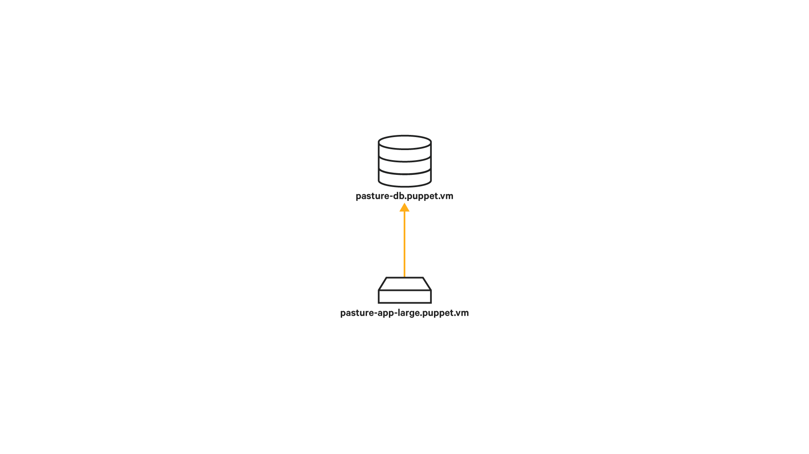

# Application Orchestrator

## Quest objectives

- Understand the role of orchestration in managing your infrastructure.
- Configure the Puppet Application Orchestration service and the Orchestrator
  client.
- Use Puppet code to define components and compose them into an application
  stack.
- Use the `puppet job run` command to apply your application across
  a group of nodes.

## Getting Started

If you manage applications comprised of multiple services distributed across multiple
nodes, you'll know that the orchestration of multiple nodes can pose some special
challenges. Your applications likely need to share information among the nodes involved
and configuration changes need to be made in the right order to keep your application's
components from getting out of sync.

Puppet's Application Orchestrator extends Puppet's powerful declarative model
from the level of the single node to that of the complex application. Describe your app
in Puppet code, and let the Application Orchestrator handle the implementation.

**Please note:** Before getting started, you should know that this quest will be a significant
step up in complexity from the ones that have come before it, both in terms of the concepts
involved and the varieties of tools and configurations you'll be working with. Keep
in mind that the Puppet Application Orchestrator is a new feature, and though it is already
a powerful tool, it will continue to be extended, refined, and integrated with the rest
of the Puppet ecosystem. In the meantime, please be patient with any issues you encounter.
You may find it useful to refer to the
[documentation for the Application Orchestrator](https://docs.puppetlabs.com/pe/latest/app_orchestration_overview.html)
to supplement the information in this quest.

Also, be aware that the multi-node setup from the previous quest is a prerequisite to
this quest. As noted in that quest, the docker technology we're using to provide multiple
nodes on a single VM does come at a certain cost to performance and stability. If you
encounter any issues, please contact us at learningvm@puppetlabs.com.

When you're ready to get started, type the following command:

    quest begin application_orchestrator

## Application orchestrator

To understand how the Application Orchestrator works, let's imagine a simple two tier
web application with a load balancer.


We have a single load balancer that distributes requests among three webservers, which
all connect to the same database server.

Each of the nodes involved in this application will have some configuration for things
not directly involved in the application. Things like sshd, and ntp will likely
be common to many nodes in your infrastructure, and Puppet won't require specific
information about the application the node is involved in to configure them correctly.
In addition to these classes and resources that are independent of the application,
each node in this example contains some components of the application: the webserver,
database, and load balancer along with whatever other resources are necessary to
support and configure their application-specific content and services.


This application specific configuration is called a component. In our example,
we define components for the database, webserver, and loadbalancer. Each
of which contains all the classes and resources necessary for a node to
fulfill its role in the application. A component is generally a defined resource
type, though it can also be a class or a single resource. A defined
resource type is flexible enough to include multiple resources and subclasses, and
unlike a class it can be declared multiple times within the same scope, allowing
our environment to have multiple instances of, for instance, the webserver component.


With all the components defined, we next define their relationships with one another
as an application. If your application is packaged as a module, this application
definition will generally go in your `init.pp` manifest.


The application definition tells these components how they'll communicate with
one another and allows the Puppet Application Orchestrator determine the order
of Puppet runs needed to correctly deploy the application to nodes in your
infrastructure.

This ordering of Puppet runs is a big part of how the tools in the Application
Orchestrator work. It requires a little more direct control over when and how
the Puppet agent runs on the nodes involved in your application. If Puppet runs
occurred at the default scheduled interval of half an hour, we'd have no
way of ensuring that the components of our application would be configured in the
correct order. If, for example, the Puppet run on our webserver happened to trigger
before that on the database server, a change to the database name would break our
application. Our webserver would still try to connect to the database from a previous
configuration, and would result in an error when that database wasn't available.

### Node Configuration

To avoid this kind of uncoordinated change, you must set the nodes involved in your
application to use a cached catalog when Puppet runs. This allows Puppet to run
as scheduled to avoid configuration drift, but will only make changes to the catalog
when you intentionally re-deploy your application. Similarly you must also disable
plugin sync to ensure that any changed functionality provided by plugins (e.g. functions
or providers) doesn't lead to uncoordinated changes to the nodes in your application.

<div class = "lvm-task-number"><p>Task 1:</p></div>

Of course, we could log in to each node and make the configuration change directly,
but why not use Puppet to configure Puppet? There is an `ini_setting` resource
that will let us make the necessary changes to the `use_cached_catalog` and
`pluginsync` settings on each agent's `puppet.conf` configuration file.

    vim /etc/puppetlabs/code/environments/production/manifests/site.pp

Because we want to apply this configuration to both the
`database.learning.puppetlabs.vm` and `webserver.learning.puppetlabs.vm` nodes,
we can use a regular expression in the node definition name to match both. Create a
new node group with the name `/^(webserver|database).*$/`, and include two
`ini_setting` resources for the configuration changes we need to make:

```puppet
node /^(webserver|database).*$/ {
  pe_ini_setting { 'use_cached_catalog':
    ensure  => present,
    path    => $settings::config,
    section => 'agent',
    setting => 'use_cached_catalog',
    value   => 'true',
  }
  pe_ini_setting { 'pluginsync':
    ensure  => present,
    path    => $settings::config,
    section => 'agent',
    setting => 'pluginsync',
    value   => 'false',
  }
} 
```

<div class = "lvm-task-number"><p>Task 2:</p></div>

You can trigger Puppet runs on the two nodes directly from the PE console.
Navigate to your PE console by entering `https://<VM'S IP ADDRESS>` in the
address bar of your browser. Log in with the following credentials:

* User: admin
* Password: puppetlabs

Go to the *Nodes* > *Inventory* section in the PE console.

Click on your `database.learning.puppetlabs.vm` node, and click on the **Run Puppet...**
button link and **Run** button to start your Puppet run. You don't need to wait for
it to finish now. Return to the **Inventory** section and trigger a run on
`webserver.learning.puppetlabs.vm` as well. While these runs are in progress,
feel free to continue with the rest of this quest. We'll check in to make sure
they've completed correctly at the point when we need to apply code to the nodes
again.

### Master Configuration

Before we get to writing and deploying an application, however, there are a few
steps we still need to do to get the Puppet Application Orchestrator tools
configured correctly.

The Puppet Orchestrator tool we'll use in this quest is a command-line interface
that interacts with an Application Orchestration service on the Puppet
master. We have enabled this service by default on the Learning VM, and it will
be enabled by default in future versions of PE. (If you would like to enable it
on your own Puppet master, please see the [details in the documentation](https://docs.puppetlabs.com/pe/latest/orchestrator_install.html#enable-the-application-orchestration-service-and-orchestrator-client).)

### Client Configuration and Permissions

While the Application Orchestration service runs on your Puppet master, the
client can be run on any system with a network connection to the master. This
means you can manage your infrastructure directly from your workstation. Because
we can't assume that the client will be run on a system with a Puppet configuration
file pointing to the correct URL and environment, we need to set these explicitly.
While these things could also be specified as flags from the command line,
creating a configuration file will save you the trouble of typing them out each
time.

<div class = "lvm-task-number"><p>Task 3:</p></div>

First, create the directory structure where this configuration file
will be kept.

    mkdir -p ~/.puppetlabs/client-tools

Now create your orchestrator configuration file.

    vim ~/.puppetlabs/client-tools/orchestrator.conf

The file is formatted in JSON. (Remember that while final commas in your
hashes are a best practice in your Puppet code, they're invalid JSON!)
Set the following options:

```json
{
  "options": {
    "url": "https://learning.puppetlabs.vm:8143",
    "environment": "production"
  }
}
```

Now the Puppet Orchestrator client knows where the Puppet master is, but the Puppet
master still needs to be able to verify that the user running commands from the
Puppet Orchestrator has the correct permissions.

This is achieved with PE's Role Based Access Control (RBAC) system, which we can
configure through the PE console.

Return to the PE console and find the **Access control** section in the left
navigation bar.

We will create a new `orchestrator` user and assign permissions to use the
application orchestrator.

Click on the **Users** section of the navigation bar. Add a new user with the
full name "Orchestrator" and login "orchestrator".

Now that this user exists, we need to set its password. Click on the user's name
to see its details, and click the "Generate password reset" link. Copy and paste the
url provided into your browser address bar, and set the user's password to "puppet".

Next, we need to give this new user permissions to run the Puppet Orchestrator.
Go to the **User Roles** section and create a new role with the name
"Orchestrators" and description "Run the Puppet Orchestrator."

Once this new role is created, click on its name to modify it. Select your
"Orchestrator" user from the drop-down menu and add it to the role.

Finally, go to the **Permissions** tab. Select "Orchestration" from the **Type**
drop-down menu, and "Run Puppet form Orchestrator" from the **Permission** drop-down.
Click **Add permission**. We also want to give this user permissions to modify
the lifetime of the token so we don't have to regenerate it every five minutes.
Select "Tokens" from the **Type** drop-down menu, and "Override default expiry"
from the **Permission** drop-down menu. Add the permission, and commit your changes. 

### Client token

Now that you have a user with correct permissions, you can generate an RBAC
access token to authenticate to the Orchestration service.

<div class = "lvm-task-number"><p>Task 4:</p></div>

The `puppet access` tool helps manage authentication. Use the
`puppet access login` command to authenticate, and it will save a token.
Add the `--lifetime=1d` flag so you won't have to keep generating new
tokens as you work.

    puppet access login --service-url https://learning.puppetlabs.vm:4433/rbac-api --lifetime=1d

When prompted, supply the username and password you set in the PE console's
RBAC system: **orchestrator** and **puppet**.

(If you get an error message, double check that you entered the url correctly.)

## Puppetized Applications

Now that you've set up your master and agent nodes for the Puppet Orchestrator and
configured your client, you're ready to define your application.

Just like the Puppet code you've worked with in previous quests, an application definition
is generally packaged in a Puppet module. The application you'll be creating in this quest
will be based on the simple Linux Apache MySQL PHP (LAMP) stack pattern.

Before we dive into the code, let's take a moment to review the plan for this application.
What we do here will be a bit simpler than the load-balanced application we discussed
above. We can save you a little typing, and still demonstrate the key features of the Application
Orchestrator.



We'll define two components which will be applied to two separate nodes. One will define the
MySQL database configuration and will be applied to the `database.learning.puppetlabs.vm`
node. The other will define the configuration for an Apache web server and a simple PHP
application and be applied to the `webserver.learning.puppetlabs.vm` node.

We can use existing modules to configure MySQL and Apache. Ensure that these are installed
on your master:

    puppet module install puppetlabs-mysql

and

    puppet module install puppetlabs-apache

So for these two nodes to be deployed correctly, what needs to happen? First, we have to
make sure the nodes are deployed in the correct order. Because our webserver node relies
on our MySQL server, we need to ensure that Puppet runs on our database server first and
webserver second. We also need a method for passing information among our nodes.
Because the information our webserver needs to connect to our database may be based
on facter facts, conditional logic, or functions in the Puppet manifest that defines
the component, Puppet won't know what it is until it actually generates the catalog
for the database node. Once Puppet has this information, it needs a way to pass it on
as parameters for our webserver component.

Both of these requirements are met through something called an environment resource. Unlike the
node-specific resources (like `user` or `file`) that tell Puppet how to configure a single
machine, environment resources carry data and define relationships across multiple nodes in an
environment. We'll get more into the details of how this works as we implement our
application.

So the first step in creating an application is to determine exactly what information
needs to be passed among the components. What does this look like in the case of our
LAMP application?

1. **Host**: Our webserver needs to know the hostname of the database server.
1. **Database**: We need to know the name of the specific database to connect to.
1. **User**: If we want to connect to the database, we'll the name of a database user.
1. **Password**: We'll also need to know the password associated with that user.

This list specifies what our database server *produces* and what our webserver
*consumes*. If we pass this information to our webserver, it will have everything
it needs to connect to the database hosted on the database server.

To allow all this information to be produced when we run Puppet on our database
server and consumed by our webserver, we'll create a custom resource type called
`sql`. Unlike a typical node resource our `sql` resource won't directly specify any changes
on our nodes. You can think of it as a sort of dummy resource. Once its parameters are set
by the database component, it just sits in an environment level catalog so those parameters
can be consumed by the webserver component. (Note that environment resources can include more
complex polling code that will let Puppet wait until a prerequisite service has come online
before moving on to dependent components. Because this requires some more complex Ruby
knowledge, it's outside the scope of this quest.)

Unlike the defined resource types that can be written in native Puppet code, creating a
custom type requires a quick detour into Ruby. The syntax will be very simple, so don't
worry if you're not familiar with the language.

<div class = "lvm-task-number"><p>Task 5:</p></div>

As before, the first step is to create your module directory structure. Make sure
you're in your modules directory:

    cd /etc/puppetlabs/code/environments/production/modules

And create your directories:

    mkdir -p lamp/{manifests,lib/puppet/type}

Note that we're burying our type in the `lib/puppet/type` directory. The `lib/puppet/`
directory is where you keep any extensions to the core Puppet language that your
module provides. For example, in addition to types, you might also define new providers
or functions.

<div class = "lvm-task-number"><p>Task 6:</p></div>

Now let's go ahead and create our new `sql` resource type.

    vim lamp/lib/puppet/type/sql.rb

The new type is defined by a block of Ruby code, like so:

```ruby
Puppet::Type.newtype :sql, :is_capability => true do
  newparam :name, :is_namevar => true
  newparam :user
  newparam :password
  newparam :host
  newparam :database
end
```

See, not too bad! Note that it's the `is_capability => true` bit that lets this
resource live on the environment level, rather than being applied to a specific
node. Everything else should be reasonably self-explanatory. Again, we don't
actually have to *do* anything with this resource, so all we have to do is tell
it what we want to name our parameters.

<div class = "lvm-task-number"><p>Task 7:</p></div>

Now that we have our new `sql` resource type, we can move on to the database
component that will produce it. This component lives in our `lamp` module
and defines a configuration for a `MySQL` server, so we'll name it `lamp::mysql`.

    vim lamp/manifests/mysql.pp

It will look like this:

```puppet
define lamp::mysql
(
  $db_user,
  $db_password,
  $host = $::hostname,
  $database = $name,
) {

  class { '::mysql::server':
    service_provider => 'debian',
    override_options => {
      'mysqld' => { 'bind-address' => '0.0.0.0' }
    },
  }

  mysql::db { $name:
    user     =>     $db_user,
    password => $db_password,
    host     => '%',
    grant    => ['SELECT', 'INSERT', 'UPDATE', 'DELETE'],
  }

  class { '::mysql::bindings':
    php_enable       => true,
    php_package_name => 'php5-mysql',
  }

}
Lamp::Mysql produces Sql {
  user     => $db_user,
  password => $db_password,
  host     => $host,
  database => $database,
}
```

Check the the manifest with the `puppet parser` tool. Because orchestration
uses some new syntax, include the `--app_management` flag.

    puppet parser validate --app_management lamp/manifests/mysql.pp

<div class = "lvm-task-number"><p>Task 8:</p></div>

Next, create a webapp component to configure an Apache server and
a simple PHP application:

    vim lamp/manifests/webapp.pp

It will look like this:

```puppet
define lamp::webapp (
  $db_user,
  $db_password,
  $db_host,
  $db_name,
  $docroot = '/var/www/html'
) {
  class { 'apache':
    default_mods  => false,
    mpm_module    => 'prefork',
    default_vhost => false,
  }

  apache::vhost { $name:
    port           => '80',
    docroot        => $docroot,
    directoryindex => ['index.php','index.html'],
  }

  package { 'php5-mysql':
    ensure => installed,
    notify => Service['httpd'],
  }

  include apache::mod::php

  $indexphp = @("EOT"/)
    <?php
    \$conn = mysql_connect('$db_host', '$db_user', '$db_password');
    if (!\$conn) {
      echo "Connection to $db_host as $db_user failed";
    } else {
      echo "Connected successfully to $db_host as $db_user";
    }
    ?>
    | EOT

  file { "${docroot}/index.php":
    ensure  => file,
    content => $indexphp,
  }

}
Lamp::Webapp consumes Sql {
  db_user     => $user,
  db_password => $password,
  db_host     => $host,
  db_name     => $database,
}
```

Again, check the syntax of your manifest.

    puppet parser validate --app_management lamp/manifests/webapp.pp

<div class = "lvm-task-number"><p>Task 9:</p></div>

Now that we have all of our components ready to go, we can define the application
itself. Because the application is the main thing provided by the `lamp` module, it goes
in the `init.pp` manifest.

    vim lamp/manifests/init.pp

We've already done the bulk of the work in our components, so this one will be pretty
simple. The syntax for an application is similar to that of a class or defined resource type.
The only difference is that we use the `application` keyword instead of `define` or
`class`.

```puppet
application lamp (
  $db_user,
  $db_password,
) {

  lamp::mysql { $name:
    db_user     => $db_user,
    db_password => $db_password,
    export      => Sql[$name],
  }

  lamp::webapp { $name:
    consume => Sql[$name],
  }

}
```

The application has two parameters, `db_user` and `db_password`. The body of the
application declares the `lamp::mysql` and `lamp::webapp` components. We pass our
`db_user` and `db_password` parameters through to the `lamp::mysql` component. This is
also where we use the special `export` metaparameter to tell Puppet we want this component
to create a `sql` environment resource, which can then be consumed by the `lamp::webapp`
component. Remember that `Lamp::Mysql produces Sql` block we put after the component
definition?

```puppet
Lamp::Mysql produces Sql {
  user     => $db_user,
  password => $db_password,
  host     => $host,
  database => $database,
}
```

This tells Puppet how to map variables parameters in our `lamp::mysql` component into
a `sql` environment resource when we use this `export` metaparameter. Note that even
though we're only explicitly setting the `db_user` and `db_password` parameters in this
component declaration, the parameter defaults from the component will pass through as well. 

The matching `Lamp::Webapp consumes Sql` block in the `webapp.pp` manifest tells Puppet
how to map the parameters of the `sql` environment resource to our `lamp::webapp` component
when we include the `consume => Sql[$name]` metaparameter.

```puppet
Lamp::Webapp consumes Sql {
  db_name     => $name,
  db_user     => $user,
  db_host     => $host,
  db_password => $password,
}
```

Once you've finished your application definition, validate your syntax and make
any necessary corrections.

    puppet parser validate --app_management lamp/manifests/init.pp

At this point, use the `tree` command to check that all the components of your
module are in place.

    tree lamp

Your module should look like the following:

    modules/lamp/
    ├── lib
    │   └── puppet
    │       └── type
    │           └── sql.rb
    └── manifests
        ├── init.pp
        ├── mysql.pp
        └── webapp.pp

    4 directories, 4 files

<div class = "lvm-task-number"><p>Task 10:</p></div>

Now that your application is defined, the final step is to declare it in your `site.pp`
manifest.

    vim /etc/puppetlabs/code/environments/production/manifests/site.pp

Until now, declarations you've made in your `site.pp` manifest have been contained by
the `learning.puppetlabs.vm` node block. An application, however, is applied to your
environment independently of any classification defined in your node blocks or the PE
console node classifier. To express this distinction, we declare our application instance
in a special block called `site`.

```puppet
site { 
  lamp { 'app1':
    db_user     => 'roland',
    db_password => '12345',
    nodes       => {
      Node['database.learning.puppetlabs.vm'] => Lamp::Mysql['app1'],
      Node['webserver.learning.puppetlabs.vm'] => Lamp::Webapp['app1'],
    }
  }
}
```

The syntax for declaring an application is similar to that of a class or resource.
The `db_user` and `db_password` parameters are set as usual.

The `nodes` parameter is where the orchestration magic happens. This parameter takes
a hash of nodes paired with one or more components. In this case, we've assigned the
`Lamp::Mysql['app1']` component to `database.learning.puppetlabs.vm` and the
`Lamp::Webapp['app1']` component to `webserver.learning.puppetlabs.vm`. When the
Application Orchestrator runs, it uses the `exports` and `consumes` metaparameters
in your application definition (in your `lamp/manifests/init.pp` manifest, for example)
to determine the correct order of Puppet runs across the nodes in the application.

Now that the application is declared in our `site.pp` manifest, we can use the
`puppet app` tool to view it.

    puppet app show

You should see a result like the following:

    Lamp['app1']
      Lamp::Mysql['app1'] => database.learning.puppetlabs.vm
          - produces Sql['app1']
      Lamp::Webapp['app1'] => webserver.learning.puppetlabs.vm
          - consumes Sql['app1']

<div class = "lvm-task-number"><p>Task 11:</p></div>

Use the `puppet job` command to deploy the application.

    puppet job run Lamp['app1']

You can check on the status of any running or completed jobs with the
`puppet job list` command.

Now that your nodes are configured with your new application, let's take a moment
to check out the result. First, we can log in to the database server and have a
look our MySQL instance.

    docker exec -it database bash

Remember, no matter what OS you're on, you can use the `puppet resource` command
to check the status of a service. Let's see if the MySQL server is running:

    puppet resource service mysql

You should see that the service is running. If you like, you can also open the client
with the `mysql` command. When you're done, use `\q` to exit.

Now go ahead and disconnect from the database node.

    exit

Instead of logging in to our webserver node, let's just check if the server is running.
In the pre-configured docker setup for this quest, we mapped port 80 on the
`webserver.learning.puppetlabs.vm` container to port 10080 on `learning.puppetlabs.vm`.
In a web browser on your host machine, go to `http://<IP_ADDRESS>:10080/index.php` to see your
PHP website.

## Review

In the quest, we discussed the role of the Puppet Orchestrator tool in coordinating Puppet
runs across multiple nodes.

Before getting into the specifics of defining an application and running it as a job, we
covered the configuration details on the Puppet agent nodes and the setup for the Puppet
Application Orchestrator client. You can review these steps and find further information
at the [Puppet Documentation](https://docs.puppetlabs.com/pe/latest/app_orchestration_overview.html)
website.

Defining an application generally requires several distinct manifests and ruby extensions:

*  Application components, which are typically written as defined resource types
*  New type definitions for any environment resources needed to pass parameters among
   your components
*  An application definition to declare your application components and specify their
   relationships to one another.
*  A declaration of your application in the `site` block of your `site.pp` manifest
   to assign your components to nodes in your infrastructure.

Once an application is defined, you can use the `puppet app show` command to see it,
and the `puppet job run` command to run it. You can see running and completed jobs with
the `puppet job list` command.
