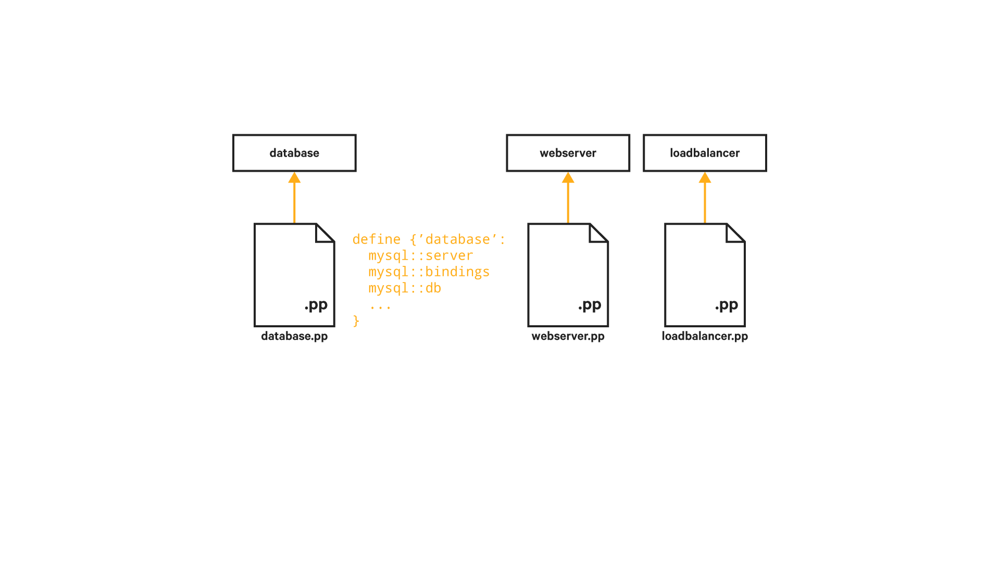



# Puppet Application Orchestrator

## Quest objectives

- Understand the role of orchestration in managing your infrastructure.
- Configure the Puppet Application Orchestration service and the orchestrator
  client.
- Use Puppet code to define components and compose them into an application
  stack.

## Getting Started

If you manage applications comprised of multiple services distributed across
multiple nodes, orchestrating changes across these nodes can pose some special
challenges. Your applications likely need to share information among the nodes
involved and configuration changes must be made in the right order to keep
your components from getting out of sync.

Puppet's Application Orchestrator extends Puppet's declarative model from the
level of the single node to the multi-node application. Describe your
application in Puppet code, and let the orchestrator handle the
implementation.

When you're ready to get started, type the following command:

    quest begin application_orchestrator

## Application orchestrator

To understand how the Puppet Application Orchestrator works, let's picture a simple
two tier web application with a load balancer.


We have a single load balancer that distributes requests among three
web servers, which all connect to the same database server.

Each of the nodes involved in this application will have some configuration for
things not directly involved in the application. Things like SSHD, and NTP will
likely be common to many nodes in your infrastructure, and Puppet won't require
specific information about the application the node is involved in to configure
them correctly. In addition to these classes and resources that are
independent of the application, each node in this example contains some
components of the application: the web server, database, and load balancer along
with whatever other resources are necessary to support and configure their
application-specific content and services.


In the context of application orchestration, we call each of these
application-specific parts of your configuration a component. In our example,
we define components for the database, web server, and load balancer. Each
component contains all the classes and resources necessary for a node to
fulfill its role in the application. A component is generally defined by a
defined resource type. Unlike an ordinary Puppet run that compiles a catalog
for a node as it checks in, the components for an application orchestration job
are compiled in a special `site` context. This means that even though you may
ultimately be applying each instance of a web server component on a distinct
node, you still need to use a defined resource type rather than a class to
avoid violating Puppet's singleton class rules.



With all the components defined, the next step is to define their relationships
with one another as an application. If your application is packaged as a
module, this application definition will generally go in your `init.pp`
manifest.


The application definition tells these components how they'll communicate with
one another and allows the Puppet Application Orchestrator to determine the order
of Puppet runs needed to correctly deploy the application to nodes in your
infrastructure.

This ordering of Puppet runs is a big part of how the tools in the
orchestrator work. It requires a little more direct control over when and how
the Puppet agent runs on the nodes involved in your application. If Puppet runs
occurred at the default scheduled interval of half an hour, we'd have no way of
ensuring that the components of our application would be configured in the
correct order. If, for example, the Puppet run on our web server happened to
trigger before that of the database server, a change to the database name would
break our application. Our web server would still try to connect to the database
from a previous configuration resulting in an error when that database
wasn't available.

## Puppetized applications

Before we dive into the code, let's take a moment to review the plan for this
application. What we do here will be a bit simpler than the load-balanced
application we discussed above. We can save you a little typing and still
demonstrate the key features of the Puppet Application Orchestrator.


We'll define two components which will be applied to two separate nodes. One
will define the PostgreSQL database configuration and will be applied to the
`pasture-db.puppet.vm` node. The other will define the configuration for
our application and be applied to the `pasture-app-large.puppet.vm` node.

The `pasture` module you created and the `postgres` module you downloaded from
the Forge already allow you to manage all the resources that will be involved
in this application. All you need to do is create the code to define how
these will work together as components in your application deployment.

So for these two nodes to be deployed correctly, what needs to happen?

First, we also need a method for passing information between our nodes. Because the
information our web server needs to connect to our database may be based on
Facter facts, conditional logic, or functions in the Puppet manifest that
define the component, Puppet won't know what it is until it actually generates
the catalog for the database node. Once Puppet has this information, it needs a
way to pass it on as parameters for our web server component.

Second, the Puppet runs on these nodes must occur in the correct order.
Because the web server node relies on the database server, Puppet must
run on the database server first and the web server second.

Both of these requirements are met through something called an environment
resource. Unlike the node-specific resources (like `user` or `file`) that tell
Puppet how to configure a single machine, environment resources carry data and
define relationships across multiple nodes in an environment. We'll get more
into the details of how this works as we implement our application.

The first step in creating an application is to determine exactly what
information needs to be passed among the components. What does this look like
in the case of our application?

1. **Host**: Our web server needs to know the hostname of the database server.
1. **Database**: We need to know the name of the specific database to which to connect.
1. **User**: If we want to connect to the database, we'll need the name of a database user.
1. **Password**: We'll also need to know the password associated with that user.

This list specifies what our database server *produces* and what our web server
*consumes*. If we pass this information to our web server, it will have
everything it needs to connect to the database hosted on the database server.

To allow all this information to be produced when we run Puppet on our database
server and be consumed by our web server, we'll create a custom resource type
called `sql`. Unlike a typical node resource, our `sql` resource won't directly
specify any changes on our nodes. You can think of it as a sort of dummy
resource. Once its parameters are set by the database component, it remains in
the site level catalog where those parameters can be consumed by the
web server component.

Unlike the defined resource types that can be written in native Puppet code,
creating a custom type requires a detour into Ruby. The syntax is simple, so
don't worry if you're not familiar with the language.

<div class = "lvm-task-number"><p>Task 1:</p></div>

As before, the first step is to create your module directory structure. Make
sure you're in your modules directory:

    cd /etc/puppetlabs/code/environments/production/modules

And create your directories:

    mkdir -p pasture_app/{manifests,lib/puppet/type}

Notice that we're creating a `lib/puppet/type` directory. The `lib/puppet/`
directory is where you keep any extensions to the core Puppet language that
your module provides. This is where you'll put the custom `sql` type that
you'll define with Ruby code.

<div class = "lvm-task-number"><p>Task 2:</p></div>

Go ahead and create this new `sql` resource type:

    vim pasture_app/lib/puppet/type/sql.rb

The new type is defined by a block of Ruby code, like so:

```ruby
Puppet::Type.newtype :sql, :is_capability => true do
  newparam :name, :is_namevar => true
  newparam :user
  newparam :password
  newparam :host
  newparam :database
end
```

The `is_capability => true` setting tells Puppet that this is an *environment
resource*. While ordinary resources are restricted to the catalog for an
individual node, environment resources are accessible by all nodes involved in
an application orchestrator job run. This means that an environment resource
can pass information across nodes involved in an orchestration job.

The second distinguishing feature is that this `sql` resource doesn't have any
associated *providers*. While most resources are intended to manage some aspect
of a system, this `sql` resource's only function is to pass its parameter
values from a database node where they're defined to a web server node that
needs to consume them. In this sense, you can think of it as a sort of dummy
resource—it uses Puppet's resource syntax to provide a set of key-value pairs
at the environment level, but doesn't directly specify any system state.

As we move on to the other components involved in the application, you will see
how this `sql` resource is produced and consumed.

<div class = "lvm-task-number"><p>Task 3:</p></div>

Now that you have this new `sql` resource type, let's move on to the database
component. This component will consist of a defined resource type similar to
the `pasture::db` profile class you created in the Forge quest.

In the same manifest, but after we've closed out the defined resource type,
we'll also include a `produces` statement to define the relationship between
our `pasture_app::db` defined resource type and the `sql` custom resource we
defined above. This `produces` statement will use the parameters set for the
`pasture_app::db` defined resource type to create an environment-level `sql`
resource that the application server will be able to consume.

    vim pasture_app/manifests/db.pp

It will look like this:

```puppet
define pasture_app::db (
  $user,
  $password,
  $host     = $::fqdn,
  $database = $name,
){
  class { 'postgresql::server':
    listen_addresses => '*',
  }
  postgresql::server::db { $name:
    user     => $user,
    password => postgresql_password($user, $password),
  }
  postgresql::server::pg_hba_rule { 'allow pasture app access':
    type        => 'host',
    database    => $database,
    user        => $user,
    address     => '172.18.0.2/24',
    auth_method => 'password',
  }
}
Pasture_App::Db produces Sql {
  user     => $user,
  password => $password,
  host     => $fqdn,
  database => $database,
}
```

Check the the manifest with the `puppet parser` tool. Use the
`--app_management` flag to enable the parser's checks for the application
orchestration syntax:

    puppet parser validate --app_management pasture_app/manifests/db.pp

<div class = "lvm-task-number"><p>Task 4:</p></div>

Next, create an `app` component to set up the Pasture application server
itself:

    vim pasture_app/manifests/app.pp

It will look like this:

```puppet
define pasture_app::app (
  $db_user,
  $db_password,
  $db_host,
  $db_name,
) {

  class { 'pasture':
    sinatra_server  => 'thin',
    db              => "postgres://${db_user}:${db_password}@${db_host}/${db_name}",
    default_message => "Hi! I'm connected to ${db_host}!",
  }

}
Pasture_App::App consumes Sql {
  db_user     => $user,
  db_password => $password,
  db_host     => $host,
  db_name     => $database,
}
```

Again, check the syntax of your manifest.

    puppet parser validate --app_management pasture_app/manifests/app.pp

<div class = "lvm-task-number"><p>Task 5:</p></div>

Now that these defined resource types are complete, define the
application itself. Because the application is the main thing provided by the
`pasture_app` module, it goes in the `init.pp` manifest.

    vim pasture_app/manifests/init.pp

We've already done the bulk of the work in our components, so this one will be pretty
simple. The syntax for an application is similar to that of a class or defined resource type.
The only difference is that we use the `application` keyword instead of `define` or
`class`.

```puppet
application pasture_app (
  $db_user,
  $db_password,
) {

  pasture_app::db { $name:
    user     => $db_user,
    password => $db_password,
    export   => Sql[$name],
  }

  pasture_app::app { $name:
    consume => Sql[$name],
  }

}
```

The application has two parameters, `db_user` and `db_password`. The body of
the application declares the `pasture_app::db` and `pasture_app::app`
components. We pass our `db_user` and `db_password` parameters through to the
`pasture_app::db` component. This is also where we use the special
`export` metaparameter to tell Puppet we want this component to create a `sql`
environment resource. The `pasture_app::app`
component includes a corresponding `consume` metaparameter to indicate that it
will consume that resource.

Once you've finished your application definition, validate your syntax and make
any necessary corrections:

    puppet parser validate --app_management pasture_app/manifests/init.pp

At this point, use the `tree` command to check that all the components of your
module are in place:

    tree pasture_app

Your module should look like the following:

    pasture_app/
    ├── lib
    │   └── puppet
    │       └── type
    │           └── sql.rb
    └── manifests
        ├── init.pp
        ├── db.pp
        └── app.pp

    4 directories, 4 files

<div class = "lvm-task-number"><p>Task 6:</p></div>

Because we will be using the orchestrator to manage these nodes, we'll remove
the application-related classes from the nodes' roles. As long as there are no
dependency relationships with any of your base profiles, you can leave these
in your roles so that they will continue to be managed on the normal Puppet
agent run schedule.

Open your `role/manifests/pasture_app.pp` manifest, and remove the
`profile::pasture::app` class.

```puppet
class role::pasture_app {
  include profile::base::motd
  include profile::pasture::dev_users
}
```

Do the same for your `role/manifests/pasture_db.pp` manifest

```puppet
class role::pasture_db {
  include profile::base::motd
}
```

<div class = "lvm-task-number"><p>Task 7:</p></div>

The final step is to declare your application in your `site.pp` manifest.

    vim /etc/puppetlabs/code/environments/production/manifests/site.pp

Until now, the configuration you've made in your `site.pp` has been in the
context of node blocks. However, an application requires a level of abstraction
above the individual node level. To express this distinction, we declare our
application instance in a special block called `site`.

```puppet
site { 
  pasture_app { 'pasture_01':
    db_user     => 'pasture',
    db_password => 'm00m00',
    nodes       => {
      Node['pasture-app-large.puppet.vm'] => Pasture_app::App['pasture_01'],
      Node['pasture-db.puppet.vm']        => Pasture_app::Db['pasture_01'],
    }
  }
}
```

The syntax for declaring an application is similar to that of a class or
resource. The `db_user` and `db_password` parameters are set as usual.

The `nodes` parameter is where the orchestration magic happens. This parameter
takes a hash of nodes paired with one or more components. In this case, we've
assigned the `Pasture::Db['pasture01']` component to
`pasture-db.puppet.vm` and the `Pasture::App['pasture_01']` component to
`pasture-app-large.puppet.vm`. When the orchestrator runs, it
uses the `exports` and `consumes` metaparameters in your application definition
(in your `pasture_app/manifests/init.pp` manifest, for example) to determine the
correct order of Puppet runs across the nodes in the application.

Now that the application is declared in our `site.pp` manifest, we can use the
`puppet job` tool to view it:

    puppet job plan --application Pasture_app

You should see a result like the following:

    +-------------------+-------------+
    | Environment       | production  |
    | Target            | Pasture_app |
    | Concurrency Limit | None        |
    | Nodes             | 2           |
    +-------------------+-------------+
    Application instances: 1
      - Pasture_app[pasture_01]
    Node run order (nodes in level 0 run before their dependent nodes in level 1, etc
    .):
    0 -----------------------------------------------------------------------
    pasture-db.puppet.vm
        Pasture_app[pasture_01] - Pasture_app::Db[pasture_01]
    1 -----------------------------------------------------------------------
    pasture-app-large.puppet.vm
        Pasture_app[pasture_01] - Pasture_app::App[pasture_01]

<div class = "lvm-task-number"><p>Task 8:</p></div>

Use the `puppet job` command to deploy the application:

    puppet job run --application Pasture_app['pasture_01']

You can check on the status of any running or completed jobs with the
`puppet job show` command.

Now that you've deployed your application, use the `curl` command to check the
default message configured for Pasture on `pasture-app-large.puppet.vm`:

    curl 'pasture-app-large.puppet.vm/api/v1/cowsay'

## Review

In the quest, we discussed the role of the Puppet Orchestrator tool in
coordinating Puppet runs across multiple nodes.

Before getting into the specifics of defining an application and running it as
a job, we covered the configuration details on the Puppet agent nodes and the
setup for the Puppet Application Orchestrator client. You can review these
steps and find further information at the [Puppet
Documentation](https://docs.puppet.com/pe/latest/app_orchestration_overview.html)
website.

Defining an application generally requires several distinct manifests and Ruby extensions:

*  Application components, which are typically written as defined resource types.
*  New type definitions for any environment resources needed to pass parameters among
   your components.
*  An application definition to declare your application components and specify their
   relationships to one another.
*  A declaration of your application in the `site` block of your `site.pp` manifest
   to assign your components to nodes in your infrastructure.

Once an application is defined, you can use the `puppet job plan` command to
see it, and the `puppet job run` command to run it. You can see running and
completed jobs with the `puppet job show` command.

## Additional Resources

* Read more about application orchestration at our [docs page](https://docs.puppet.com/pe/latest/app_orchestration_overview.html).
* Check out an overview of the feature on the [product page](https://puppet.com/product/capabilities/orchestration).
* If you’re interested in a concrete demonstration, look at this [example application GitHub repository](https://github.com/puppetlabs/puppetlabs-wordpress_app).
