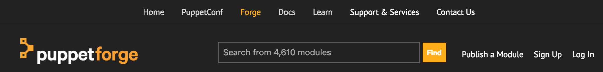



# Forge Modules

## Quest objectives

- Learn how to access the Puppet Forge and find a module.
- TBD 

## Getting started

In this quest, you'll learn how to use class parameters to adapt an existing
module from the [Puppet Forge](forge.puppet.com) to your own needs. We'll
use an Apache module to install and configure an Apache webserver on
our agent node.

Once you understand how to configure class using parameters, you'll learn how
to write your own parameterized class. To do this, you'll need to make use of
variables, which let you pass data from a class's parameters to the resources
contained within the class.

When you're ready to get started, enter the following command:

    quest begin forge_modules

## The Forge

The (Puppet Forge)[forge.puppet.com] is a public repository for Puppet modules.
The Forge gives you access to a wide variety of community maintained modules,
that help you Puppetize your infrastructure without re-inventing the wheel.
The Forge website includes features for searching and rating modules to help
you effeciently find high-quality Puppet code.

Puppet also maintains a list of **Puppet Approved** modules, which have been
audited to ensure quality, reliability, and active development, and **Puppet
Supported** modules, which are covered by Puppet Enterprise support and
maintained across multiple platforms over the Puppet Enterprise release
lifecycle.

In this quest, you'll install and configure an Apache server on an agent node.
While it would be possible to construct your own class with all the resources
needed to manage the Apache package, configuration files, and service, it's
easier to use a provided by a module from the Forge. Selecting a high-quality
Forge module can also give you the advantages of testing, robust documentation,
continuing updates, and cross-platform flexibility, things that would take a
significant ongoing time investment to create and maintain for an in-house
module.

As a first, step, let's take a moment to find an appropriate module. The
Forge website provides a search function that lets you quickly search for
modules based on keyword and filter according to your platform and version
requirements.



A quick search for `apache` gives us some promising results.


For this quest, we'll select the first result, the
[https://forge.puppet.com/puppetlabs/apache](puppetlabs-apache) module.

To give the Puppet master access to the classes defined by this module, we'll
need to install it into the **modulepath**. If you take a look at the Forge
page for the module, you'll see there there are two methods of installation
listed.


Though managing modules with a Puppetfile is the preferred workflow, we'll save
discussion of this method for a later quest where we can cover the reasons for
it in more detail.  For now, look at the second instruction for installation
with the `puppet module` tool. This tool will simply download the module from
the Forge and place the full module directory into your Puppet master's
modulepath.

It's important to be aware of what version of a module you install. This
ensures that the Puppet code you apply in production, for example, actually
matches what you used for testing. We ran our own tests for the Learning VM
with version 1.10.0 of the `puppetlabs-apache` module, so we'll tell the Puppet
module tool to install this version:

    puppet module install puppetlabs-apache --version 1.10.0

Now that this module is installed, the `apache` class is available to be used
in node classification. When you started this quest, the quest tool created a
`webserver.puppet.vm` node for you. Open your `site.pp` manifest and create a
new node declaration to classify this node with the `apache` class. We want to
use the class defaults for now, so we'll use the simple `include` syntax.

```puppet
node webserver.puppet.vm {
  include apache
}
```

Now connect to `webserver.puppet.vm`.

    ssh root@webserver.puppet.vm

Trigger a Puppet agent run on this node. The Puppet agent will contacts the
Puppet master and presents it with some information about the system where it's
running, including the domain name specified in your `site.pp` manifest's node
block.  The Puppet master uses this information build a catalog that defines
the desired state for the node. It sends this catalog back to the Puppet agent
on the node, which makes any changes necessary to bring the node's state in
line with that defined by the catalog.

    puppet agent -t

You'll see some output scroll across the screen as the Puppet agent applies
these changes.

The most direct way to see if the server is running is to see what's served on
the default port 80 for localhost.

    curl localhost

Because you haven't created an `index.html` file, Apache returns an empty index
of its `docroot` directory.

## Writing a wrapper class

To help provide content, let's integrate a webserver into the `cowsay` module
you created in the previous quest. We'll give you a simple PHP script to serve
the output of the `cowsay` command, and show you how to manage it with a `file`
resource.

First, disconnect from the `webserver.puppet.vm` node to return to the Puppet
master node.

    exit

Now navigate to your `modules` directory:

    cd /etc/puppetlabs/code/environments/production/modules

Create a new `webserver.pp` manifest in your `cowsay/manifests/` directory.

    vim cowsay/manifests/webserver.pp

Here, create a new `cowsay::webserver` class. This will wrap the main Apache
class along with the Apache PHP module class that will configure your server to
handle PHP content. (If you're wondering how you would have known to include
this `apache::mod::php` class, take a look back at the
[documentation](https://forge.puppet.com/puppetlabs/apache#classes-apachemodmodule-name)
on the Forge page.)

```puppet
class cowsay::webserver {
  include apache
  include apache::mod::php
}
```

Great, now open the main `init.pp` manifest.

    vim cowsay/manifests/init.pp

And add a line to include this new `cowsay::webserver` class.

```puppet
class cowsay {
  include cowsay::fortune
  include cowsay::webserver
  package { 'cowsay':
    ensure   => present,
    provider => 'gem',
  }
}
```

Now all that remains is to tell Puppet to manage an `index.php` in your Apache
server's default `docroot` direcotry (`/var/www/html/`).

The first step is to create a `files` directory inside the `cowsay` module
directory. Just as placing manifests inside a module's `manifests` directory
lets Puppet find them, you can make any files your module needs available to
Puppet by placing them in the module's `files` directory.

    mkdir cowsay/files 

Now create an `index.php` file in that directory:

    vim cowsay/files/index.php

Type out or copy and paste the content below. (To copy and paste cleanly into
Vim, hit `ESC` to ensure you're in command mode, type `: set paste` and enter.
Type `i` to return to insert mode before pasting in your text. Paste mode
prevents Vim from automatically formatting text as it's pasted in.) 

```php
<html>
  <head>
  </head>
  <body>
    <pre>
      <?php
        exec("fortune | cowsay", $output);
        echo implode("\n", $output);
      >
    </pre>
  </body>
</html>
```

With this source file in place, all that remains is to create a `file` resource
to manage it.

The `file` resource can take a `source` parameter, which allows you to specify
a source file instead of specifying the content directly as you would with the
`content` parameter. As its value, this parameter takes a URI. To refer to
files on the Puppet master, you can use a shortened `puppet:` URI that
specifies a location in Master's Puppet code directory. This `puppet:` URI
follows the format `puppet:///modules/<MODULE NAME>/<FILE PATH>`.  Notice the
triple forward slash.  (Remember, you can always refer back to the
[docs](https://docs.puppet.com/puppet/latest/reference/types/file.html#file-attribute-source)
for a reminder if you have trouble remembering this precise syntax in the
future.)

To add this file resource, return to your `init.pp` manifest.

    vim cowsay/manifests/init.pp

And add a file resource declaration.

```puppet
class cowsay {
  include cowsay::fortune
  include cowsay::webserver

  package { 'cowsay':
    ensure   => present,
    provider => 'gem',
  }

  file { '/var/www/html/index.php':
    source => 'puppet:///modules/cowsay/index.php',
  }
}
```

Finally, open your `site.pp` manifest.

    vim /etc/puppetlabs/code/environments/production/manifests/site.pp

And replace the `include apache` line in your `webserver.puppet.vm` node
declaration with `include cowsay`.

```puppet
node 'webserver.puppet.vm` {
  include cowsay
}
```

Now that the node is classified, connect to it.

    ssh learning@webserver.puppet.vm

And trigger a Puppet agent run to see your changes take effect.

    sudo puppet agent -t

Before inspecting the results of applying this class, this is a good point to
an important feature of Puppet's declarative model for defining system state.
You may have noted that the `cowsay` class you just applied includes the
`apache` class you applied earlier in this quest. Because Puppet is declarative
and state-based, most Puppet runs have a property called **idempotence**. This
means that you can apply the same Puppet code multiple times without changing
the result.

In this case, because Apache is already installed and configured on
the server in the way specified by the Apache class, Puppet will find no
difference between the actual and desired states of the resources specified in
the `apache` class, so won't tell its providers to make any changes to the
system. 

Now that you've applied your changes, let's check our server again to see how
it works in the context of the `cowsay` module to generate content.

    curl localhost

## Review

TBD
