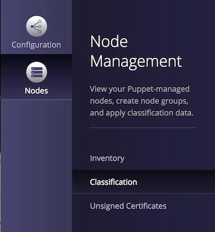
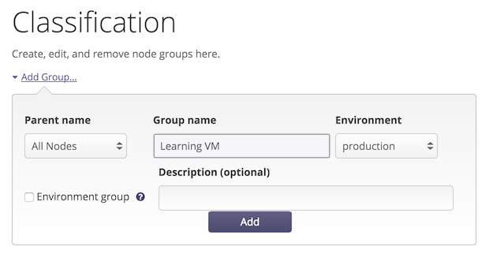

# Hello Puppet

## Quest objectives

- Familiarize yourself with this guide and the `quest` tool.
- Install the Puppet agent on a newly provisioned node.
- Sign your new node's certificate to add it to your Puppet infrastructure.
- Use `puppet resource` and `facter` to inspect the state of your new system.

## Get started

> Any sufficiently advanced technology is indistinguishable from magic.

> - Arthur C. Clarke

Welcome to the Quest Guide for the Puppet Learning VM. This guide will be
your companion as you make your way through a series of interactive quests,
using the accompanying VM as a sandbox environment to exercise your Puppet
skills.

This first quest will introduce you to the integrated `quest` tool you will use
to set up your environment on the VM prior to each quest and track your
progress through each task covered in this guide.

Once you're familiar with the quest tool, we'll move on to Puppet itself.
You'll learn how to install the Puppet agent on a newly provisioned node and
use `puppet resource` and `facter` to start exploring the state of that new
system in the language of *resources* and *facts*, the fundamental units of
information Puppet uses to understand and manage system infrastructure.

As you get started with this guide, remember that Puppet is a powerful
and complex tool. We will explain concepts as needed to complete and understand
each task in a quest, but will occasionally introduce a topic that needs to
wait for a later quest for a full explanation. (We can avoid dependency cycles
in code, but it's not always possible to keep them out of learning materials!)

Ready to get started? Run the following command on your Learning VM:

    quest begin hello_puppet

## An introduction to the quest tool

When you ran the `quest begin hello_puppet` command, you saw some text scroll
by in your terminal. Each time you start a new quest, the `quest` tool uses
Puppet to set up everything you'll need to complete that quest. In this case,
it created new containerized node that we will use to guide you through the
Puppet agent installation.

The `quest` tool has some other features that will help you keep on track as
you work through this guide. You can use the `--help` flag to list the
available subcommands.

Task 1:

    quest --help

As you entered that command, you might have noticed that the status line in the
bottom right of your terminal changed. This status line helps you keep track of
your progress through the tasks in each quest.

Task 2:

To see a more detailed list of these tasks, use the `status` subcommand. 

    quest status

## The Puppet agent

The puppet agent is the piece of the Puppet setup that lives on the systems you
want to manage. Whenever the Puppet agent runs, it asks the Puppet master for a
catalog—a description of what its system should look like. It compares this
catalog to the actual state of the system, then makes any changes needed to
make the actual state match the state described in the catalog.

The Learning VM already has a Puppet master pre-installed. To complete the
picture and try out a puppet run, we'll need to install the Puppet agent on the
new node the we set up for this quest. The Puppet master hosts an install
script you can easily grab and run from your agent nodes.

Task 3:

First, use `ssh` to connect to your node:

    ssh root@hello.learning.puppetlabs.vm

Then paste in the following command to run the agent installer:

    curl -k https://learning.puppetlabs.vm:8140/packages/current/install.bash | sudo bash

## Class and classification

The `graphite` *module* includes Puppet code that defines a `graphite` *class*.
In Puppet, a *class* is simply a named block of Puppet code that defines a set
of associated system resources. A class might install a package, customize an
associated configuration file for that package, and start a service provided by
that package. These are related and interdependent processes, so it makes sense
to organize them into a single configurable unit: a class.

While a module can include many classes, it will generally have a main class that
shares the name of the module. This main class will often handle the basic installation
and configuration of the primary component the module is designed to manage.

The `graphite` class contains the instructions Puppet needs to set up Graphite,
but you still need to tell Puppet where and how you want it to apply the class
across your infrastructure. This process of matching classes to nodes is
called *classification*.

### Access the PE console

We're going to explore some alternative ways to classify nodes in future quests, but for
the moment we'll opt for the simplicity of the the PE console's built-in node classifier.
Now that you have the module installed, let's go through the steps of creating
a node group, adding the Learning VM to the group, and classifying the group with the
`graphite` class.

But before you can access the PE console you'll need the Learning VM's IP address.

Task 3:

Of course, you could use a command like `ifconfig` to find this, but let's do it the Puppet
way. Puppet uses a tool called `facter` to collect facts about a system and make them
available at catalog compilation. This is how it knows, for example, whether it's on
Ubuntu and needs to use `apt-get` or CentOS and needs `yum`. You'll learn more about
facts and conditionals in Puppet later. For now, we can use `facter` in the command-line
to determine the Learning VM's IP address.

    facter ipaddress

Open a web browser on your host machine and go to `https://<IPADDRESS>`, where
`<IPADDRESS>` is the Learning VM's IP address. (Be sure to include the `s` in
`https`!)

The PE console certificate is self-signed, so your browser may give you a security notice.
Go ahead and bypass this notice to continue to the console.

When prompted, use the following credentials to log in:

  * username: **admin** 
  
  * password: **puppetlabs**

### Create a node group

Now that you have access to the PE console, we'll walk you through the steps
to classify the "learning.puppetlabs.vm" node (i.e. the Learning VM)
with the `graphite` class.

First, create a **Learning VM** node group. Node groups allow you to 
segment all the nodes in your infrastructure into separately configurable groups
based on the node's certname and all information collected by the `facter` tool.

Click on *Classification* in the console navigation bar. It may take a moment to load.

From here, enter "Learning VM" as a new node group name and click *Add group* to create
your new node group.

Click on the new group to set the rules for this group. You only want the `learning.puppetlabs.vm` in
this group, so instead of adding a rule, use the *Pin node* option to add the node individually.

Click on the *Node name* field, and you should see the Learning VM's certname autofilled. If no matching
certname appears, trigger a Puppet run (`puppet agent -t`) on the Learning VM. As part of the Puppet
run, the Learning VM will check in, making its information available to the console node classifier.

Click *Pin node*, then click the *Commit 1 change* button in the bottom right of the console
interface to commit your change.

### Add a class

When you installed the `dwerder-graphite` module from the forge, it made the `graphite`
class available in the console.

Under the *Classes* tab in the interface for the Learning VM node group, find the *Class name*
text box. If `graphite` is not yet available, click the *Refresh* button near the top right
of the classes interface and wait a moment before trying again. (If the class still does not
appear, check the [troubleshooting guide](https://github.com/puppetlabs/courseware-lvm/blob/master/SETUP.md#troubleshooting) for more information.)

Once you have entered `graphite` in the *Class name* text box, click the *Add class* button.

Before you apply the class, there are a few parameters you'll want to set.

We already have an Apache server configured to our liking on the Learning VM, so we can
tell the `graphite` class it doesn't need to bother setting up its own server.

There are also some compatibility issues with the latest Django version. The author of this
`graphite` module has made it easy to get around this problem by picking our
own compatible Django version to use. (Keep this in mind when you start writing your own modules!)

Set the parameters, as follows:

1. `gr_web_server      = none`
1. `gr_django_pkg      = django`
1. `gr_django_provider = pip`
1. `gr_django_ver      = "1.5"`

Note that the `gr_django_ver` parameter takes a string, not float value, so it must
be wrapped in quotes for Puppet to parse it correctly.

Double check that you have clicked the *Add parameter* button for all of your parameters,
then click the *Commit 5 changes* button in the bottom right of the console window
to commit your changes.

### Run Puppet

Now that you have classified the `learning.puppetlabs.vm` node with the
`graphite` class, Puppet knows how the system should be configured, but it won't
make any changes until a Puppet run occurs. 

By default, the Puppet agent daemon runs in the background on all nodes you manage with
Puppet. Every 30 minutes, the Puppet agent daemon requests a *catalog* from the
Puppet master. The Puppet master parses all the classes applied to that node,
builds the catalog to describe how the node is supposed to be configured, and
returns this catalog to the node's Puppet agent. The agent then applies any changes
necessary to bring the node in line with the state described by the
catalog.

Task 4:

To avoid surprises, however, we've disabled these scheduled runs on the Learning VM.
Instead, we'll be using the `puppet agent` tool to trigger runs manually.

As you're working through this Quest Guide, keep in mind that the Learning VM is running *both*
a Puppet master *and* a Puppet agent. This is a bit different than what you'd see in
a typical architecture, where a single Puppet master would serve a collection of
Puppet agent nodes. The Puppet master is where you keep all your Puppet code. Earlier
when you used the `puppet module` tool to install the `graphite` module, that was a
task for the Puppet master. When you want to manually trigger a Puppet run with the
`puppet agent` tool, that's a command you would use on an agent node, not the master.

So put on your agent hat and trigger a Puppet run:

    puppet agent --test

Graphite is a complex piece of software with many dependencies, so this may take a while
to run. After a brief delay, you will see text scroll by in your terminal indicating
that Puppet has made all the specified changes to the Learning VM.

You can also check out the Graphite console running on port 90. (`http://<IPADDRESS>:90`)

We've selected a few parameters as an example. Paste the following path after the
Graphite console URL to try it out:

    /render/?width=586&height=308&_salt=1430506380.148&from=-30minutes&fontItalic=false&fontName=Courier&target=alias(carbon.agents.learning_puppetlabs_vm-a.cpuUsage%2C"CPU")&target=alias(secondYAxis(carbon.agents.learning_puppetlabs_vm-a.memUsage)%2C"Memory")&majorGridLineColor=C0C0C0&minorGridLineColor=C0C0C0

Note that Graphite has only been running for a few minutes, so it may not yet
have much data to chart. If you wait a minute and refresh the page in your
browser, you will see the graph update with new data.

## Review

Great job on completing the quest! You should now have a good idea of how to
download existing modules from the Forge and use the PE console node classifier
to apply them to a node. You also learned how to use the the `facter` command
to retrieve system information, and the `puppet agent --test` command to manually
trigger a Puppet run.
